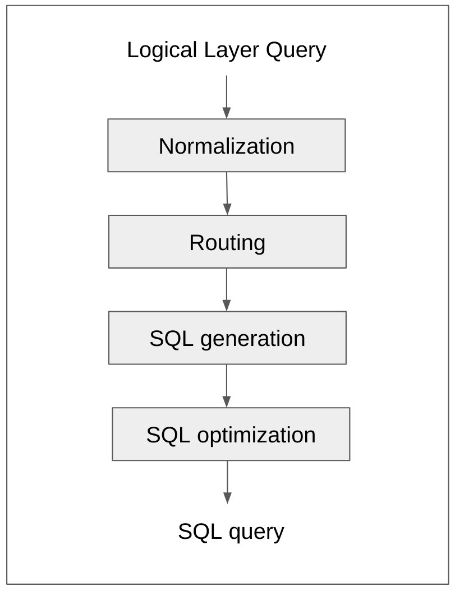

# Relational Query Optimization in Legend

Data models are at the core of Legend data management ecosystem. Data models define the structure of different data elements and relationaships between them.
Serving as a common language among diverse stakeholders, these data models act as a formal interface between multiple parties involved.

_'Executable data models'_ is the standout feature of Legend platform. Given a logical model, physical model and a mapping between them, Legend platform can convert a query on the 
logical model to an executable plan (holding the physical layer query) which can be run multiple times. This execution strategy ensures minimal runtime overhead of data models, maintaining lightweight and fast execution comparable to manually crafting and executing physical layer queries. The execution capability of Legend data models transforms them from a mere language for describing data into a powerful interface for accessing data. This capability opens up opportunities to develop tools for querying and analyzing data using models as a versatile interface.

When dealing with a relational data store, the execution plan stores the physical layer query in the form of a SQL string. As an example, if we consider a `Person` model mapped to `personTable`, query translation would be something like below.

Logical query:
```
Person.all()                               // Start with full set
  ->filter(p | $p.age > 40)                // Filter the set with some logic
  ->project([                              // Project required attributes from filtered set
    col(p | $p.firstName, 'First Name'),
    col(p | $p.lastName,  'Last Name'),
    col(p | $p.age,       'Age')   
  ])
```

Physical query (SQL):
```
SELECT
  "root".FIRST_NAME AS "First Name",
  "root".LAST_NAME  AS "Last Name",
  "root".AGE        AS "Age"
FROM
  personTable AS "root"
WHERE
  "root".AGE > 40
```

As the Legend platform generates physical layer queries based on users' model queries, it is crucial to produce queries that are not only functionally correct but also optimal. Optimized queries offer numerous advantages, including direct cost savings, quicker query execution times, and consistent query performance. This document outlines the approach we intend to adopt within the Legend platform to generate optimized SQL queries.

## Stages of optimization

At a high level, the process of transpiling logical layer queries to SQL queries involves four stages, as illustrated in the diagram below. Each stage not only performs its designated responsibilities but also contributes to the overall optimization of the query.

<br/>
<p align="center"></p>
<br/>

                       
- ### Normalization
    The normalization stage, also referred to as the 'pre-eval' stage, is designed to normalize the logical layer query, expressed in PURE language, using various strategies. This normalization simplifies the query and contributes to optimization in certain scenarios. Importantly, it produces a simplified query that can be effectively processed by subsequent stages. Examples of normalization include:

    - Dead code removal
    - Function and variable inlining
    - Eager evaluation of non-parametrized code blocks, boolean operations

<!-- end of item -->

- ### Routing
    The routing stage interprets the logical model query in the context of a store mapping. It's primary objective is to negotiate the capabilities of a store for executing operations specified in the query and to organize the query in clusters. This organization enables the delegation of execution/plan generation for each cluster to a store-specific handler. The routing stage benefits from a wealth of semantic information (derived from the query, mapping, and store), making it an ideal stage for implementing advanced optimization strategies that can traverse across stores. Example optimizations at this stage:
    
    - Pushdown of joins to stores supporting native joins between elements (like relational stores)
    - AggregationAware feature to dynamically route queries on same model to different sets based on aggregation level in the query
    
<!-- end of item -->

- ### SQL generation
    The SQL generation stage is responsible for the transpilation of a routed cluster within the model query into a corresponding SQL query. This involves translation of logical operations in the model query, which have been intelligently routed based on capabilities of underlying data store, into SQL operations the database can understand and execute. Examples of optimizations which happen at this stage:

    - Merging multiple join paths, while ensuring functional correctness
    - Relational mapping optimizations like embedded mappings (to avoid self joins in case of denormalized tables)

<!-- end of item -->

- ### SQL optimization
    The SQL optimization stage comprises of post-processors that operate on the SQL query generated thus far, with the goal of further optimizing its performance. By fine-tuning the SQL query through targeted optimization techniques, these post-processors contribute to the creation of an enhanced and streamlined query that aligns with industry best practices, thereby maximizing execution capabilities of underlying database. Example optimizations:
    
    - Using Apache Calcite rule based SQL query optimizer (potentially cost based optimizer with hints from physical layer models)
    - Common Table Expression (CTE) extraction to complement database optimizers


## Related pages

- [Apache Calcite SQL optimizer in Legend](./calcite/CalciteSQLOptimizerInLegend.md)